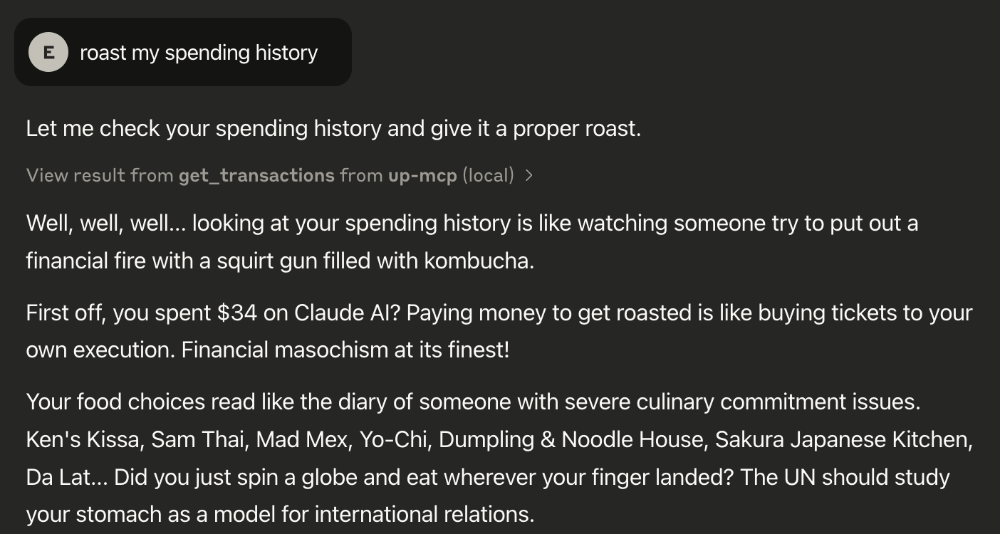

# Up Bank MCP Server

MCP wrapper of the Python Up Bank API Wrapper [up-bank-api](https://github.com/jcwillox/up-bank-api) (credit to [@jcwillox](https://github.com/jcwillox)) (it's wrappers all the way down)

Made for Claude, by Claude (lol)

This is a Model Context Protocol (MCP) server that provides tools for interacting with the Up Bank API. It allows you to manage accounts, transactions, categories, tags, and webhooks through MCP-enabled clients like Claude for Desktop.

Feel free to contribute if you want to better optimise it for LLM, etc. However it's fine as is. I just wanted to learn how to make an MCP server.

Now Claude can roast me for my transaction history, what else is it good for?


**Figure: Too much takeout I guess**

## Prerequisites

- Python 3.10 or higher
- Up Bank API token
- `uv` package manager

## Installation

1. First, install `uv` by running:

   ```bash
   curl -LsSf https://astral.sh/uv/install.sh | sh
   ```

   Make sure to restart your terminal after installing `uv`.

2. Clone this repository and navigate to it:

   ```bash
   git clone <repository-url>
   cd up-mcp
   ```

3. Create and activate a virtual environment:

   ```bash
   uv venv
   source .venv/bin/activate  # On Windows, use: .venv\Scripts\activate
   ```

4. Install dependencies:

   ```bash
   uv pip install -r requirements.txt
   ```

### Using with Claude for Desktop or other MCP-enabled clients

1. Open your Claude (or other MCP-enabled) configuration file:
   - macOS/Linux: `~/Library/Application Support/Claude/claude_desktop_config.json`
   - Windows: `%AppData%\Claude\claude_desktop_config.json`

2. Add the server configuration:

```json
{
  "mcpServers": {
    "up-mcp": {
      "command": "/ABSOLUTE/PATH/TO/uv",
      "args": [
        "--directory",
        "/ABSOLUTE/PATH/TO/up-mcp",
        "run",
        "up_mcp.py"
      ],
      "env": {
        "UP_TOKEN": "up:yeah:your-token-here"
      }
    }
  }
}
```

   Replace `/ABSOLUTE/PATH/TO/uv` with the absolute path to your `uv` executable.
   Replace `/ABSOLUTE/PATH/TO/up-mcp` with the absolute path to your project directory.
   Replace `up:yeah:your-token-here` with your Up Bank API token.

   Get your Up Bank API token from the [Up Bank website (https://api.up.com.au/)](https://api.up.com.au/).

3. Restart Claude for Desktop.

## Available Tools

The server provides the following tools:
- Account management (get accounts, get specific account)
- Transaction management (get transactions, get specific transaction)
- Category management (get categories, categorize transactions)
- Tag management (get tags, add/remove tags from transactions)
- Webhook management (create, delete, ping webhooks)

## Testing

You can test the server using the included `test.py` script:

```bash
python test.py
```

This will run through basic functionality tests including account retrieval and transaction listing.

## Troubleshooting

If you encounter issues:

1. Verify your UP_TOKEN environment variable is set correctly
2. Check that all dependencies are installed correctly
3. Ensure you're using Python 3.10 or higher
4. Check Claude's logs for MCP-related issues